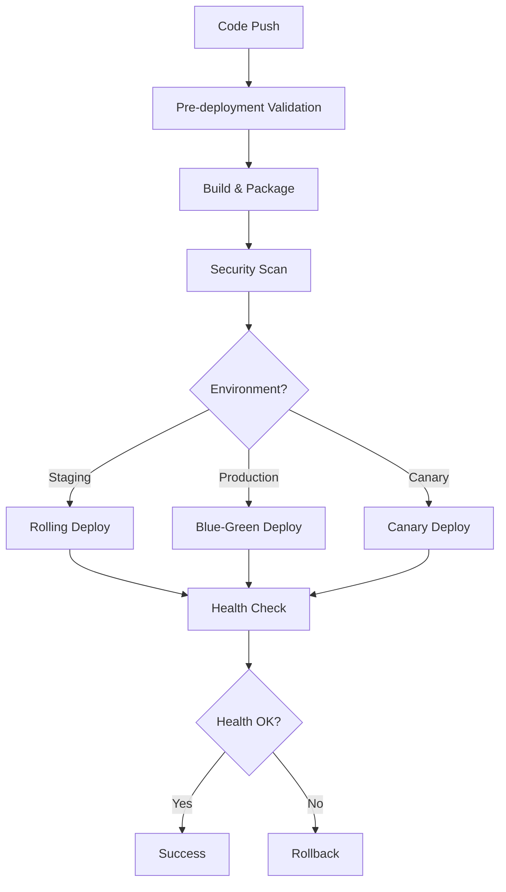

# 🚀 Enterprise GitHub Workflows Documentation

This directory contains comprehensive GitHub workflows implementing enterprise-grade DevSecOps practices used by leading technology companies like Netflix, Google, and Amazon. These workflows ensure security, quality, compliance, and operational excellence for the Thorbis local business directory platform.

## 📋 Workflow Overview

| Workflow | Purpose | Trigger | Duration | Critical Path |
|----------|---------|---------|----------|---------------|
| [Security Comprehensive](#-security-comprehensive) | Multi-layer security scanning | Push, PR, Schedule | ~15-20 min | ✅ Blocking |
| [Quality & Compliance](#-quality--compliance) | Code quality and standards | Push, PR | ~10-15 min | ✅ Blocking |
| [Testing Comprehensive](#-testing-comprehensive) | Multi-tier testing strategy | Push, PR, Schedule | ~25-30 min | ✅ Blocking |
| [Deployment Advanced](#-deployment-advanced) | Blue-green/canary deployments | Push to main/develop | ~20-45 min | ⚠️ Critical |
| [Monitoring & Observability](#-monitoring--observability) | System health monitoring | Schedule (15min) | ~5-10 min | 📊 Monitoring |
| [Compliance & Governance](#-compliance--governance) | GDPR, accessibility, standards | Schedule (weekly) | ~15-20 min | 📋 Audit |

## 🔒 Security Comprehensive

**File**: `security-comprehensive.yml`

### Purpose
Implements multi-layer security scanning following OWASP and NIST guidelines, including SAST, dependency scanning, container security, and secrets detection.

### Key Features
- **Static Application Security Testing (SAST)**:
  - CodeQL analysis for JavaScript/TypeScript
  - Semgrep rule-based scanning
  - Custom security queries
- **Dependency Vulnerability Scanning**:
  - Bun audit for Node.js dependencies
  - Snyk vulnerability scanning
  - OWASP Dependency Check
  - SBOM (Software Bill of Materials) generation
- **Container Security**:
  - Trivy vulnerability scanner
  - Snyk container scanning
  - Multi-architecture image scanning
- **Infrastructure as Code Security**:
  - Checkov for Terraform/Docker/K8s
  - TFSec for Terraform-specific issues
- **Secrets Detection**:
  - GitLeaks historical scanning
  - TruffleHog verified secrets detection
- **License Compliance**:
  - FOSSA license scanning
  - Automated license validation

### Triggers
- Push to any branch
- Pull requests to main/develop
- Weekly schedule (Mondays 2 AM UTC)
- Manual dispatch

### Environment Variables Required
```bash
SNYK_TOKEN=<snyk-api-token>
FOSSA_API_KEY=<fossa-api-key>
GITLEAKS_LICENSE=<gitleaks-license-key>
SLACK_SECURITY_WEBHOOK=<slack-webhook-for-security-alerts>
```

### Success Criteria
- No critical vulnerabilities in dependencies
- No secrets exposed in code
- All containers pass security scanning
- SPDX license compliance maintained

## 🎯 Quality & Compliance

**File**: `quality-compliance.yml`

### Purpose
Ensures code quality, performance standards, and accessibility compliance following industry best practices.

### Key Features
- **Code Quality Analysis**:
  - ESLint with custom enterprise rules
  - TypeScript strict mode validation
  - Prettier formatting compliance
  - Code complexity analysis
  - SonarCloud integration
- **Performance Analysis**:
  - Bundle size monitoring
  - Performance budget enforcement
  - Webpack bundle analysis
  - Core Web Vitals tracking
- **Accessibility Compliance**:
  - Lighthouse accessibility audits
  - axe-core WCAG 2.1 AA validation
  - Color contrast verification
- **Architecture Analysis**:
  - Dependency graph generation
  - Component architecture review
  - API route analysis
- **Documentation Quality**:
  - Markdown linting
  - Required documentation validation
  - API documentation coverage

### Triggers
- Push to any branch
- Pull requests to main/develop
- Manual dispatch

### Environment Variables Required
```bash
SONAR_TOKEN=<sonarcloud-token>
CODECOV_TOKEN=<codecov-token>
LHCI_GITHUB_APP_TOKEN=<lighthouse-ci-token>
```

### Performance Budgets
- Main bundle: <250KB
- Chunk size: <100KB
- LCP: <2.5s
- FID: <100ms
- CLS: <0.1

## 🧪 Testing Comprehensive

**File**: `testing-comprehensive.yml`

### Purpose
Implements multi-tier testing strategy including unit, integration, E2E, performance, and chaos engineering tests.

### Key Features
- **Unit Testing**:
  - Parallel test execution with sharding
  - Multiple test runners (Vitest, Jest)
  - Coverage reporting and enforcement
- **Integration Testing**:
  - Database integration with PostgreSQL/Redis
  - API endpoint testing
  - Service integration validation
- **Component Testing**:
  - React Testing Library
  - Storybook visual regression testing
  - Chromatic integration
- **End-to-End Testing**:
  - Playwright multi-browser testing
  - Parallel execution across browsers
  - Visual diff testing
- **API Testing**:
  - Newman (Postman) collection testing
  - Supertest integration
  - Contract testing
- **Performance Testing**:
  - Lighthouse performance audits
  - Artillery load testing
  - Memory leak detection
- **Chaos Engineering**:
  - Database connection chaos
  - Network latency simulation
  - Memory pressure testing

### Test Matrix
```yaml
# Unit Tests
test-runners: [vitest, jest]
shards: [1, 2, 3, 4]

# E2E Tests  
browsers: [chromium, firefox, webkit]
shards: [1, 2, 3]

# API Tests
environments: [staging, mock]
```

### Coverage Requirements
- Line coverage: >80%
- Branch coverage: >75%
- Function coverage: >90%

## 🚀 Deployment Advanced

**File**: `deployment-advanced.yml`

### Purpose
Implements enterprise-grade deployment strategies with blue-green deployments, canary releases, and automated rollback capabilities.

### Key Features
- **Deployment Strategies**:
  - Rolling deployments for staging
  - Blue-green deployments for production
  - Canary deployments with traffic splitting
  - Automated rollback on failure
- **Pre-deployment Validation**:
  - Security vulnerability checks
  - Performance regression testing
  - Database migration validation
- **Multi-environment Support**:
  - Staging environment
  - Production environment
  - Canary environment
  - Preview environments
- **Container Management**:
  - Multi-architecture builds (AMD64, ARM64)
  - Container registry management
  - Image signing and verification
- **Database Management**:
  - Automated backup before migration
  - Migration verification
  - Rollback capabilities
- **Post-deployment Monitoring**:
  - Health checks
  - Smoke tests
  - Performance monitoring
  - Synthetic transaction tests

### Deployment Flow


## 📊 Monitoring & Observability

**File**: `monitoring-observability.yml`

### Purpose
Provides comprehensive system monitoring, health checks, and observability for production systems.

### Key Features
- **Health Monitoring**:
  - Multi-service health checks (web, api, database, cdn, storage)
  - Response time monitoring
  - Error rate tracking
  - Availability monitoring
- **Performance Monitoring**:
  - Lighthouse performance audits
  - Core Web Vitals tracking
  - Bundle size monitoring
  - API response time analysis
- **Application Metrics**:
  - Database performance metrics
  - Connection pool monitoring
  - Query performance analysis
  - Slow query detection
- **Security Monitoring**:
  - SSL certificate expiry monitoring
  - Security headers validation
  - Vulnerability scanning
  - Access pattern analysis
- **Synthetic Monitoring**:
  - User journey simulation
  - Transaction monitoring
  - Business-critical flow validation
- **Incident Response**:
  - Automated incident detection
  - Emergency notifications
  - System status aggregation

### Monitoring Matrix
```yaml
environments: [production, staging]
services: [web, api, database, cdn, storage]
pages: [home, search, business-profile, user-dashboard]
transactions: [user-signup, business-search, review-submission]
```

### Alert Thresholds
- Response time: >1000ms
- Error rate: >1%
- SSL expiry: <30 days
- Performance score: <90

## 📋 Compliance & Governance

**File**: `compliance-governance.yml`

### Purpose
Ensures compliance with GDPR, accessibility standards, security frameworks, and enterprise governance requirements.

### Key Features
- **GDPR Compliance**:
  - Data collection pattern analysis
  - Consent mechanism validation
  - Data portability feature checks
  - Privacy policy validation
  - Cookie compliance verification
- **Accessibility Compliance**:
  - WCAG 2.1 AA validation
  - axe-core accessibility testing
  - Lighthouse accessibility audits
  - Color contrast analysis
  - Screen reader compatibility
- **Security Compliance**:
  - OWASP Top 10 compliance
  - Security headers verification
  - API security analysis
  - Input validation checks
  - Authentication/authorization audits
- **Code Quality Standards**:
  - Complexity analysis
  - Test coverage validation
  - Documentation coverage
  - Maintainability scoring
- **License Compliance**:
  - SPDX license validation
  - Forbidden license detection
  - License compatibility checks
  - Third-party license auditing
- **API Documentation**:
  - OpenAPI specification validation
  - Documentation coverage analysis
  - Endpoint documentation verification

### Compliance Scoring
```javascript
const complianceScore = (passedAudits / totalAudits) * 100;

// Audit categories:
// - GDPR: Data handling, consent, privacy
// - Accessibility: WCAG 2.1 AA, screen readers
// - Security: OWASP Top 10, headers, auth
// - Quality: Complexity, coverage, docs
// - License: SPDX, forbidden licenses
// - API: Documentation, specifications
```

## 🔧 Setup & Configuration

### 1. Repository Secrets

Add the following secrets to your GitHub repository:

```bash
# Security Scanning
SNYK_TOKEN=<snyk-api-token>
FOSSA_API_KEY=<fossa-api-key>
GITLEAKS_LICENSE=<gitleaks-license>

# Code Quality
SONAR_TOKEN=<sonarcloud-token>
CODECOV_TOKEN=<codecov-token>
LHCI_GITHUB_APP_TOKEN=<lighthouse-ci-token>

# Deployment
VERCEL_TOKEN=<vercel-deployment-token>
STAGING_DEPLOY_TOKEN=<staging-deployment-token>
PRODUCTION_DEPLOY_TOKEN=<production-deployment-token>
DATABASE_URL=<production-database-url>

# Monitoring
MONITORING_API_URL=<monitoring-service-api>
MONITORING_API_TOKEN=<monitoring-api-token>

# Notifications
SLACK_WEBHOOK_URL=<general-notifications>
SLACK_SECURITY_WEBHOOK=<security-alerts>
SLACK_ALERTS_WEBHOOK=<system-alerts>
SLACK_EMERGENCY_WEBHOOK=<emergency-notifications>

# Incident Management
INCIDENT_MANAGEMENT_API=<incident-api-url>
INCIDENT_MANAGEMENT_TOKEN=<incident-api-token>
```

### 2. Branch Protection Rules

Configure branch protection for main and develop branches:

```yaml
# .github/branch-protection.yml
protection_rules:
  main:
    required_status_checks:
      - "Security Audit"
      - "Code Quality"
      - "Test Suite"
      - "E2E Tests"
    required_reviews: 2
    dismiss_stale_reviews: true
    require_code_owner_reviews: true
    restrictions:
      users: []
      teams: ["tech-leads", "security-team"]
  
  develop:
    required_status_checks:
      - "Security Audit"
      - "Code Quality"
      - "Test Suite"
    required_reviews: 1
    dismiss_stale_reviews: false
```

### 3. Environment Configuration

Set up GitHub environments for deployment:

#### Staging Environment
- Protection rules: No restrictions
- Secrets: Staging-specific values
- URL: https://staging.thorbis.com

#### Production Environment  
- Protection rules: Required reviewers (tech leads)
- Deployment branches: main only
- Secrets: Production values
- URL: https://thorbis.com

### 4. Required Package.json Scripts

Add these scripts to your `package.json`:

```json
{
  "scripts": {
    "lint": "eslint . --ext .js,.ts,.jsx,.tsx",
    "lint:ci": "eslint . --ext .js,.ts,.jsx,.tsx --format json --output-file eslint-report.json",
    "lint:report": "eslint . --ext .js,.ts,.jsx,.tsx --format html --output-file eslint-report.html",
    "type-check": "tsc --noEmit",
    "type-check:strict": "tsc --noEmit --strict",
    "type-check:report": "tsc --noEmit --listFiles > type-check-report.txt",
    "format:check": "prettier --check .",
    "test:unit": "vitest run",
    "test:unit:jest": "jest --ci",
    "test:integration": "vitest run --config vitest.integration.config.ts",
    "test:component": "vitest run --config vitest.component.config.ts",
    "test:api": "vitest run --config vitest.api.config.ts",
    "test:api:supertest": "jest --config jest.api.config.js",
    "test:e2e": "playwright test",
    "test:performance": "lighthouse-ci autorun",
    "test:chaos": "node scripts/chaos-testing.js",
    "test:coverage": "vitest run --coverage",
    "test:smoke:staging": "playwright test --config playwright.smoke.config.ts",
    "test:smoke:production": "playwright test --config playwright.smoke.config.ts --base-url=https://thorbis.com",
    "analyze": "next build && next-bundle-analyzer",
    "analyze:bundle": "bundlesize",
    "analyze:webpack": "ANALYZE=true next build",
    "check:performance-budget": "bundlesize",
    "build-storybook": "storybook build",
    "db:migrate": "node scripts/migrate-database.js",
    "db:migrate:test": "NODE_ENV=test node scripts/migrate-database.js",
    "db:seed:test": "NODE_ENV=test node scripts/seed-database.js",
    "db:verify": "node scripts/verify-migration.js",
    "deploy:staging": "vercel deploy --token=$VERCEL_TOKEN --scope=staging",
    "deploy:production": "vercel deploy --prod --token=$VERCEL_TOKEN",
    "verify:deployment-metrics": "node scripts/verify-deployment-metrics.js"
  }
}
```

## 📈 Monitoring & Metrics

### Key Performance Indicators (KPIs)

| Metric | Target | Warning | Critical |
|--------|--------|---------|----------|
| Build Success Rate | >99% | <95% | <90% |
| Security Scan Pass Rate | 100% | <100% | N/A |
| Test Coverage | >80% | <75% | <70% |
| Performance Score | >90 | <85% | <80% |
| Deployment Success Rate | >98% | <95% | <90% |
| Mean Time to Detection (MTTD) | <5min | <10min | <15min |
| Mean Time to Recovery (MTTR) | <30min | <60min | <120min |

### Dashboards

1. **Security Dashboard**: Vulnerability trends, scan results, compliance status
2. **Quality Dashboard**: Code quality metrics, test coverage, technical debt
3. **Performance Dashboard**: Core Web Vitals, bundle sizes, performance budgets
4. **Deployment Dashboard**: Deployment frequency, success rates, rollback frequency
5. **System Health Dashboard**: Uptime, response times, error rates

## 🚨 Incident Response

### Automated Response Matrix

| Alert Level | Response Time | Escalation | Actions |
|-------------|---------------|------------|---------|
| Critical | Immediate | PagerDuty + Slack | Auto-rollback, emergency contacts |
| High | <5 minutes | Slack + Email | Investigation team notified |
| Medium | <15 minutes | Slack | Development team notified |
| Low | <1 hour | Email | Log for review |

### Runbooks

1. **Deployment Failure**: Auto-rollback → Health check → Investigation
2. **Security Alert**: Immediate notification → Code freeze → Patch deployment
3. **Performance Degradation**: Traffic analysis → Resource scaling → Code optimization
4. **Test Failures**: Block deployment → Root cause analysis → Fix and retry

## 🔄 Continuous Improvement

### Weekly Reviews
- Security scan results and trends
- Code quality metrics and improvements
- Test coverage and failure analysis
- Performance benchmark comparisons
- Deployment success rates and issues

### Monthly Audits
- Comprehensive compliance review
- Workflow optimization opportunities
- Tool and technology updates
- Process improvement recommendations

### Quarterly Assessments
- Industry best practice alignment
- Technology stack evaluation
- Security framework updates
- Performance benchmark adjustments

## 📚 Additional Resources

- [GitHub Actions Documentation](https://docs.github.com/en/actions)
- [OWASP DevSecOps Guideline](https://owasp.org/www-project-devsecops-guideline/)
- [NIST Cybersecurity Framework](https://www.nist.gov/cyberframework)
- [WCAG 2.1 Guidelines](https://www.w3.org/WAI/WCAG21/quickref/)
- [Core Web Vitals](https://web.dev/vitals/)

---

**Note**: These workflows represent enterprise-grade DevSecOps practices used by leading technology companies. Regular review and updates are recommended to maintain alignment with evolving security threats and industry standards.