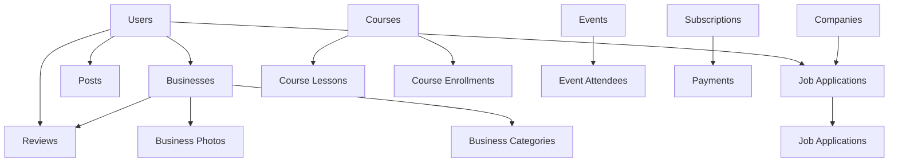

# Complete Supabase Schema for Business Directory

This directory contains a comprehensive, production-ready Supabase schema designed for a full-featured business directory website with jobs, events, courses, social features, and more.

## 🏗️ Schema Features

Based on the [Supabase TypeScript generation documentation](https://supabase.com/docs/guides/api/generating-types), this schema includes:

### **Core Business Directory**
- ✅ **Businesses** with spatial indexing and full-text search
- ✅ **Categories** with hierarchical support
- ✅ **Reviews & Ratings** with automatic business rating updates
- ✅ **Business Photos** with primary image support
- ✅ **Users** with role-based permissions

### **Jobs & Employment**
- ✅ **Companies** for job posting management
- ✅ **Jobs** with advanced search and filtering
- ✅ **Job Applications** with status tracking
- ✅ **User Profiles** with resume and portfolio links

### **Content & Learning**
- ✅ **Blog Posts** with categories and SEO optimization
- ✅ **Events** with virtual/physical location support
- ✅ **Courses** with lessons and enrollment tracking
- ✅ **Shorts** (short-form video content)

### **Social & Networking**
- ✅ **User Connections** (LinkedIn-style networking)
- ✅ **Social Posts** with interactions
- ✅ **Comments** and engagement tracking

### **Business Features**
- ✅ **Advertising Campaigns** and ad management
- ✅ **Subscription Plans** with billing integration
- ✅ **Support Tickets** with messaging
- ✅ **Business Certifications**
- ✅ **Table Reservations** (for restaurants)

### **Enterprise Features**
- ✅ **Analytics Events** tracking
- ✅ **Security Audit Log**
- ✅ **Performance Metrics** monitoring
- ✅ **Form Submissions** handling
- ✅ **Newsletter Subscriptions**

## 🚀 Quick Setup

### 1. Install Dependencies

```bash
# Install Supabase CLI
bun add supabase@">=1.8.1" --dev

# Or if you prefer npm
npm install supabase@">=1.8.1" --save-dev
```

### 2. Run the Complete Schema

Copy the contents of `complete_schema.sql` and paste it into your **Supabase SQL Editor**:

1. Go to your [Supabase Dashboard](https://supabase.com/dashboard)
2. Navigate to **SQL Editor**
3. Create a new query
4. Paste the entire contents of `lib/supabase/complete_schema.sql`
5. Click **Run** to execute

### 3. Generate TypeScript Types

After running the schema:

```bash
# Generate types from your database
bun run types:generate

# This creates lib/supabase/database.types.ts with all your table types
```

### 4. Test Your Setup

```bash
# Test the connection and schema
bun run test:supabase
```

### 5. Seed with Test Data

Choose one of two seeding methods:

#### **Option A: JavaScript Seeding (Recommended)**
```bash
# Seed with realistic test data using Faker.js
bun run seed:database
```

#### **What Gets Seeded**
The JavaScript seeding creates realistic test data using Faker.js:

- 🧑‍💼 **100 Users** with different roles (user, business_owner, admin, moderator)
- 🏢 **200 Businesses** with locations, ratings, photos, and reviews
- 🏭 **50 Companies** for job postings
- 💼 **150 Jobs** with realistic salaries and requirements
- 📝 **80 Blog Posts** with SEO optimization
- 🎉 **60 Events** (virtual and physical)
- 📚 **40 Courses** with progress tracking
- ⭐ **500 Reviews** with ratings and responses
- 🔔 **200+ Notifications** for user engagement
- 📊 **1000+ Analytics Events** for testing dashboards

All data includes proper relationships, realistic content using Faker.js, and follows your schema constraints.

## 📊 Database Schema Overview

### **Table Relationships**



### **Performance Optimizations**

- 🔍 **Full-text search** indexes on businesses, jobs, blog posts, events
- 📍 **Spatial indexes** for location-based queries using PostGIS
- ⚡ **Composite indexes** for common query patterns
- 🚀 **Optimized functions** for complex searches and analytics

### **Security Features**

- 🛡️ **Row Level Security (RLS)** enabled on all tables
- 🔐 **Role-based permissions** (user, business_owner, admin, moderator)
- 📝 **Security audit logging** for compliance
- 🔒 **Data validation** with check constraints

## 🛠️ Available Scripts

```bash
# Database Management
bun run db:push          # Push local changes to Supabase
bun run db:reset         # Reset database to clean state

# Type Generation
bun run types:generate   # Generate TypeScript types from schema

# Testing & Seeding
bun run test:supabase    # Test database connection and schema
bun run seed:database    # Seed database with realistic test data
```

## 📚 Usage Examples

### **Basic Business Query**

```typescript
import { supabase } from '@/lib/supabase';

// Get all published businesses with reviews
const { data: businesses } = await supabase
  .from('businesses')
  .select(`
    *,
    reviews(*),
    business_photos(*),
    business_categories(
      categories(*)
    )
  `)
  .eq('status', 'published')
  .eq('verified', true);
```

### **Advanced Job Search**

```typescript
import { supabase } from '@/lib/supabase';

// Use the optimized search function
const { data: jobs } = await supabase.rpc('search_jobs', {
  search_term: 'developer',
  job_type_filter: 'full_time',
  location_filter: 'San Francisco',
  remote_filter: true,
  min_salary: 80000,
  result_limit: 20
});
```

### **Nearby Businesses (Spatial Query)**

```typescript
import { supabase } from '@/lib/supabase';

// Find businesses within 10km of coordinates
const { data: nearbyBusinesses } = await supabase.rpc('get_nearby_businesses', {
  lat: 37.7749,
  lng: -122.4194,
  radius_km: 10,
  result_limit: 20
});
```

### **User Analytics**

```typescript
import { supabase } from '@/lib/supabase';

// Get comprehensive user analytics
const { data: analytics } = await supabase.rpc('get_user_analytics', {
  user_uuid: userId
});

// Returns: total_businesses, total_reviews, total_posts, etc.
```

### **Working with Seeded Data**

```typescript
// Get recent businesses in a specific city
const { data: businessesInNY } = await supabase
  .from('businesses')
  .select(`
    *,
    reviews(rating, text, created_at),
    business_categories(categories(name))
  `)
  .eq('city', 'New York')
  .eq('status', 'published')
  .order('created_at', { ascending: false })
  .limit(10);

// Find high-paying remote jobs
const { data: remoteJobs } = await supabase
  .from('jobs')
  .select(`
    *,
    companies(name, logo_url, industry)
  `)
  .eq('remote_ok', true)
  .gte('salary_min', 80000)
  .eq('status', 'published');

// Get upcoming events with attendee count
const { data: upcomingEvents } = await supabase
  .from('events')
  .select(`
    *,
    event_attendees(count)
  `)
  .eq('status', 'upcoming')
  .gte('start_date', new Date().toISOString())
  .order('start_date', { ascending: true });
```

## 🔧 Advanced Configuration

### **Custom Business Categories**

```sql
-- Add new business category
INSERT INTO categories (name, slug, description, "order") 
VALUES ('Tech Startups', 'tech-startups', 'Technology startup companies', 9);
```

### **Subscription Plan Management**

```sql
-- Add new subscription plan
INSERT INTO subscription_plans (
  name, description, price, billing_interval, 
  features, max_businesses, max_ads, max_events
) VALUES (
  'Startup', 'Perfect for growing startups', 149.99, 'month',
  '["Everything in Professional", "API access", "White-label options"]',
  25, 50, 30
);
```

### **Custom RLS Policies**

```sql
-- Example: Allow business managers to edit business info
CREATE POLICY "Business managers can edit businesses" ON businesses
FOR UPDATE USING (
  EXISTS (
    SELECT 1 FROM business_managers bm
    WHERE bm.business_id = businesses.id
    AND bm.user_id = auth.uid()
    AND bm.role IN ('admin', 'manager')
  )
);
```

## 📈 Performance Monitoring

The schema includes built-in performance tracking:

```typescript
// Performance metrics are automatically logged
// Query the performance_metrics table for insights
const { data: metrics } = await supabase
  .from('performance_metrics')
  .select('*')
  .gte('created_at', new Date(Date.now() - 24 * 60 * 60 * 1000))
  .order('duration_ms', { ascending: false });
```

## 🔄 Real-time Features

Enable real-time subscriptions for live updates:

```typescript
import { SupabaseRealtime } from '@/lib/supabase';

// Subscribe to business changes
const unsubscribe = SupabaseRealtime.subscribeToBusinessChanges(
  businessId,
  (payload) => {
    console.log('Business updated:', payload);
    // Update your UI
  }
);

// Cleanup when component unmounts
unsubscribe();
```

## 🚨 Important Notes

### **Required Extensions**
The schema automatically enables these PostgreSQL extensions:
- `uuid-ossp` - for UUID generation
- `postgis` - for spatial/geographic queries
- `pg_trgm` - for full-text search optimization

### **Environment Variables**
Make sure your `.env.local` includes:
```env
NEXT_PUBLIC_SUPABASE_URL=https://hdiuifrlulzpvasknzqm.supabase.co
NEXT_PUBLIC_SUPABASE_ANON_KEY=sb_publishable_fi1Knpd6lz__Iw5v-uunEw_8AYCrbyH
SUPABASE_SERVICE_ROLE_KEY=sb_secret_Pnk_NHm-hm0r3iKiCdRIWw_lbzuPCUY
```

### **Data Migration**
When transitioning from existing data:
1. Export your current data
2. Run the new schema
3. Map your data to the new table structure
4. Import using the provided sample data as a guide

## 🆘 Troubleshooting

### **Common Issues**

1. **Schema conflicts**: Drop existing tables if needed before running the complete schema
2. **Permission errors**: Ensure your Supabase user has sufficient privileges
3. **Type generation fails**: Make sure Supabase CLI is logged in (`supabase login`)
4. **Seeding fails**: Make sure your schema is deployed first and all environment variables are set
5. **Foreign key errors**: Ensure categories and subscription plans exist before running seed script

### **Getting Help**

- 📖 [Supabase Documentation](https://supabase.com/docs)
- 🔧 [Supabase CLI Reference](https://supabase.com/docs/reference/cli)
- 📊 [TypeScript Generation Guide](https://supabase.com/docs/guides/api/generating-types)

## 🎯 Next Steps

1. **Run the schema** using the `complete_schema.sql` file
2. **Generate types** with `bun run types:generate`
3. **Test connection** with `bun run test:supabase`
4. **Seed test data** with `bun run seed:database`
5. **Start building** your application with full type safety
6. **Monitor performance** using the built-in metrics tables

This schema provides a solid foundation for a scalable, feature-rich business directory with modern web application requirements. All features are production-ready with proper indexing, security, and performance optimizations. 